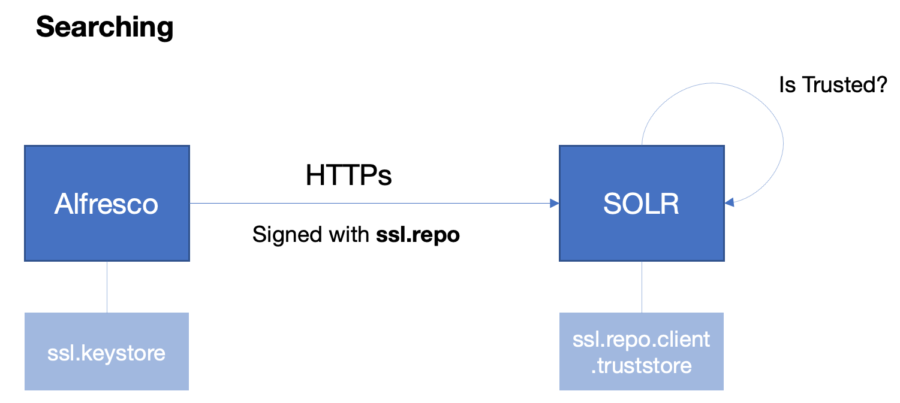
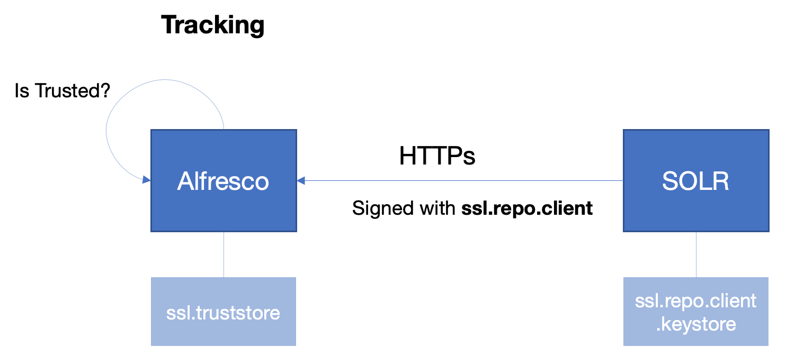
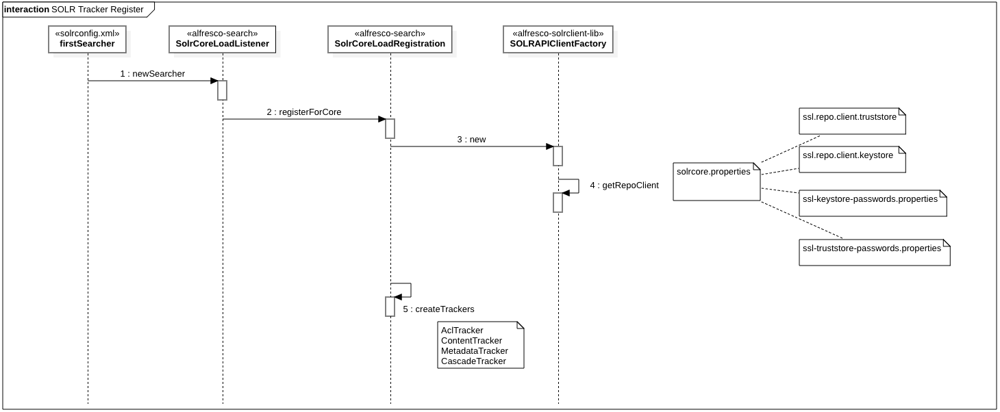
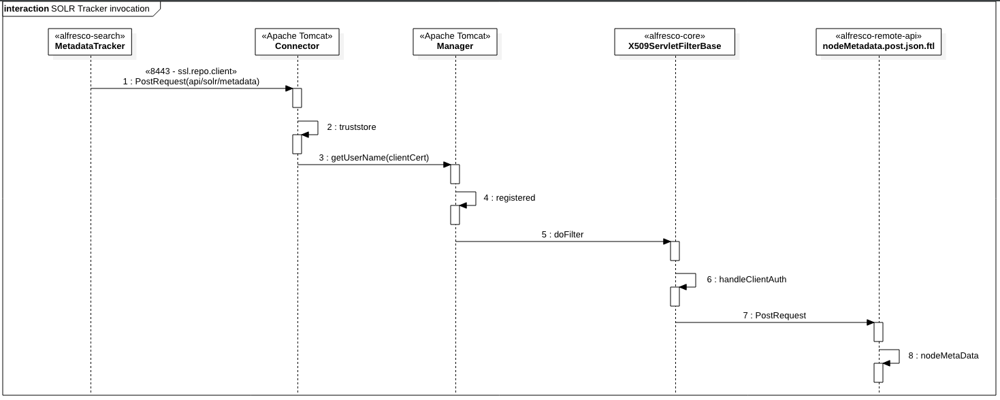
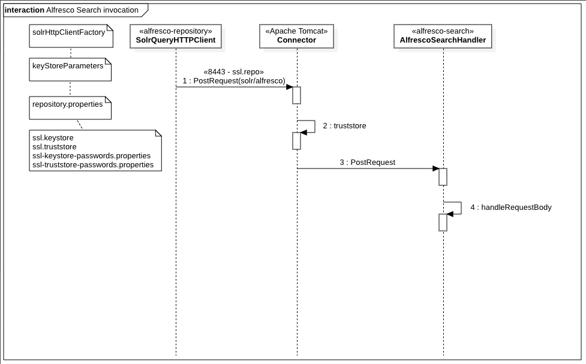

# SOLR SSL Configuration

This document describes SOLR SSL/TLS Configuration for Alfresco Platform for Alfresco 5.2.

This configuration was changed in Alfresco 6.0 and Search Services 1.1, since from this versions communication was released in plain HTTP. When using plain HTTP, access to SOLR APIs and SOLR Web Console must be protected using an HTTP Proxy or equivalent. Otherwise this resources are public and everyone has access to content without restrictions.

# ACS 5.2 and SOLR 4

ACS 5.2 is released by default using Mutual TLS communication with SOLR relying on X509 Certificates.

## Default certificates

Default password for every store and certificate: `kT9X6oe68t`

### Repository

Certificates used by the repository:

* `alfresco.ca` public certificate used as trusted CA

* `ssl.repo` private certificate used to sign SSL requests to SOLR

These certificates are installed in some different stores provided from source code, in **alfresco-repository** artifact.

https://github.com/Alfresco/alfresco-repository/tree/alfresco-repository-7.62/src/main/resources/alfresco/keystore

classpath:alfresco/keystore/ssl.truststore

```
[PUBL] alfresco.ca
Subject: CN=Alfresco CA, O=Alfresco Software Ltd., L=Maidenhead, ST=UK, C=GB
Issuer:  CN=Alfresco CA, O=Alfresco Software Ltd., L=Maidenhead, ST=UK, C=GB
```

classpath:alfresco/keystore/ssl.keystore

```
[PUBL] ssl.alfresco.ca (unused, alternative alias to "alfresco.ca")
Subject: CN=Alfresco CA, O=Alfresco Software Ltd., L=Maidenhead, ST=UK, C=GB
Issuer:  CN=Alfresco CA, O=Alfresco Software Ltd., L=Maidenhead, ST=UK, C=GB

[PRIV] ssl.repo
Subject: CN=Alfresco Repository, OU=Unknown, O=Alfresco Software Ltd., L=Maidenhead, ST=UK, C=GB
Issuer:  CN=Alfresco CA, O=Alfresco Software Ltd., L=Maidenhead, ST=UK, C=GB
```

**Encryption key**

Another store, including a secret key, is also provided from **alfresco-repository**. This key is used for encryption features.

Password: mp6yc0UD9e

classpath:alfresco/keystore/keystore

```
Alias name: metadata
Entry type: SecretKeyEntry
```

### SOLR 4

Certificates used by the repository:

* `alfresco.ca` public certificate used as trusted CA

* `ssl.repo.client` private certificate used to sign SSL requests to Repository

Both *workspace* and *archive* cores are using the same files for the *truststore* and the *keystore*.

These certificates are installed in some different stores provided from source code, in **alfresco-search** artifact.

https://github.com/Alfresco/SearchServices/tree/1.3.0.2/alfresco-search/src/main/resources/solr/instance/templates/rerank/conf

**Workspace**

/workspace-SpacesStore/conf/ssl.repo.client.truststore

```
[PUBL] alfresco.ca
Subject: CN=Alfresco CA, O=Alfresco Software Ltd., L=Maidenhead, ST=UK, C=GB
Issuer:  CN=Alfresco CA, O=Alfresco Software Ltd., L=Maidenhead, ST=UK, C=GB
```

/workspace-SpacesStore/conf/ssl.repo.client.keystore

```
[PUBL] alfresco.ca (unused)
Subject: CN=Alfresco CA, O=Alfresco Software Ltd., L=Maidenhead, ST=UK, C=GB
Issuer:  CN=Alfresco CA, O=Alfresco Software Ltd., L=Maidenhead, ST=UK, C=GB

[PRIV] ssl.repo.client
Subject: CN=Alfresco Repository Client, OU=Unknown, O=Alfresco Software Ltd., L=Maidenhead, ST=UK, C=GB
Issuer:  CN=Alfresco CA, O=Alfresco Software Ltd., L=Maidenhead, ST=UK, C=GB
```

**Archive**

/archive-SpacesStore/conf/ssl.repo.client.truststore

```
[PUBL] alfresco.ca
Subject: CN=Alfresco CA, O=Alfresco Software Ltd., L=Maidenhead, ST=UK, C=GB
Issuer:  CN=Alfresco CA, O=Alfresco Software Ltd., L=Maidenhead, ST=UK, C=GB

```

/archive-SpacesStore/conf/ssl.repo.client.keystore

```
[PUBL] alfresco.ca (unused)
Subject: CN=Alfresco CA, O=Alfresco Software Ltd., L=Maidenhead, ST=UK, C=GB
Issuer:  CN=Alfresco CA, O=Alfresco Software Ltd., L=Maidenhead, ST=UK, C=GB

[PRIV] ssl.repo.client
Subject: CN=Alfresco Repository Client, OU=Unknown, O=Alfresco Software Ltd., L=Maidenhead, ST=UK, C=GB
Issuer:  CN=Alfresco CA, O=Alfresco Software Ltd., L=Maidenhead, ST=UK, C=GB
```

## Configuration

SSL configuration is performed in Repository side and also in SOLR side.

### Repository

Alfresco Repository properties configuration to set SOLR secure port.

<ALFRESCO_TOMCAT_HOME>/shared/classes/alfresco-global.properties

```
solr.host=localhost
solr.port.ssl=8443
```

Tomcat configuration to deal with requests from SOLR.

<ALFRESCO_TOMCAT_HOME>/conf/server.xml

```xml
<Connector port="8443" protocol="org.apache.coyote.http11.Http11Protocol"
      SSLEnabled="true" maxThreads="150" scheme="https"
      keystoreFile="<ALFRESCO_HOME>/alf_data/keystore/ssl.keystore"
      keystorePass="kT9X6oe68t" keystoreType="JCEKS" secure="true" connectionTimeout="240000"
      truststoreFile="<ALFRESCO_HOME>/alf_data/keystore/ssl.truststore"
      truststorePass="kT9X6oe68t" truststoreType="JCEKS" clientAuth="want" sslProtocol="TLS"/>  
```

This configuration is *optional*, as the username is not checked in the source code.

<ALFRESCO_TOMCAT_HOME>/conf/tomcat-users.xml

```xml
<user username="CN=Alfresco Repository, OU=Unknown, O=Alfresco Software Ltd., L=Maidenhead, ST=UK, C=GB" roles="repository" password="null"/>
```

Default passwords for stores and certificates are also provided from source code.

classpath:alfresco/keystore/ssl-keystore-passwords.properties

```
aliases=ssl.alfresco.ca,ssl.repo
keystore.password=kT9X6oe68t
ssl.repo.password=kT9X6oe68t
ssl.alfresco.ca.password=kT9X6oe68t
```

classpath:alfresco/keystore/ssl-truststore-passwords.properties

```
aliases=alfresco.ca
keystore.password=kT9X6oe68t
alfresco.ca.password=kT9X6oe68t
```

### SOLR 4

SOLR properties configuration for SSL are included in every core.

**Workspace**

/workspace-SpacesStore/conf/solrcore.properties

```
alfresco.host=localhost
alfresco.port.ssl=8443

alfresco.encryption.ssl.keystore.type=JCEKS
alfresco.encryption.ssl.keystore.provider=
alfresco.encryption.ssl.keystore.location=ssl.repo.client.keystore
alfresco.encryption.ssl.keystore.passwordFileLocation=ssl-keystore-passwords.properties
alfresco.encryption.ssl.truststore.type=JCEKS
alfresco.encryption.ssl.truststore.provider=
alfresco.encryption.ssl.truststore.location=ssl.repo.client.truststore
alfresco.encryption.ssl.truststore.passwordFileLocation=ssl-truststore-passwords.properties
```

**Archive**

/archive-SpacesStore/conf/solrcore.properties

```
alfresco.host=localhost
alfresco.port.ssl=8443

alfresco.encryption.ssl.keystore.type=JCEKS
alfresco.encryption.ssl.keystore.provider=
alfresco.encryption.ssl.keystore.location=ssl.repo.client.keystore
alfresco.encryption.ssl.keystore.passwordFileLocation=ssl-keystore-passwords.properties
alfresco.encryption.ssl.truststore.type=JCEKS
alfresco.encryption.ssl.truststore.provider=
alfresco.encryption.ssl.truststore.location=ssl.repo.client.truststore
alfresco.encryption.ssl.truststore.passwordFileLocation=ssl-truststore-passwords.properties
```

Tomcat configuration to deal with requests from Alfresco.

<SOLR4_TOMCAT_HOME>/conf/server.xml

```xml
<Connector port="8443" protocol="org.apache.coyote.http11.Http11Protocol"
      SSLEnabled="true" maxThreads="150" scheme="https"
      keystoreFile="<ALFRESCO_HOME>/alf_data/keystore/ssl.keystore"
      keystorePass="kT9X6oe68t" keystoreType="JCEKS" secure="true" connectionTimeout="240000"
      truststoreFile="<ALFRESCO_HOME>/alf_data/keystore/ssl.truststore"
      truststorePass="kT9X6oe68t" truststoreType="JCEKS" clientAuth="want" sslProtocol="TLS"/>  
```

Default passwords for stores and certificates are also provided from source code.

**Workspace**

/workspace-SpacesStore/conf/ssl-keystore-passwords.properties

```
aliases=ssl.alfresco.ca,ssl.repo.client
keystore.password=kT9X6oe68t
ssl.repo.client.password=kT9X6oe68t
ssl.alfresco.ca.password=kT9X6oe68t
```

/workspace-SpacesStore/conf/ssl-truststore-passwords.properties

```
aliases=alfresco.ca
keystore.password=kT9X6oe68t
alfresco.ca.password=kT9X6oe68t
```

**Archive**

/solr4/archive-SpacesStore/conf/ssl-keystore-passwords.properties

```
aliases=ssl.alfresco.ca,ssl.repo.client
keystore.password=kT9X6oe68t
ssl.repo.client.password=kT9X6oe68t
ssl.alfresco.ca.password=kT9X6oe68t
```

/solr4/archive-SpacesStore/conf/ssl-truststore-passwords.properties

```
aliases=alfresco.ca
keystore.password=kT9X6oe68t
alfresco.ca.password=kT9X6oe68t
```

## Communication

Communication between Alfresco and SOLR happens using signed HTTPs requests.





Below a detailed sequence is described for these scenarios.

### Tracking from SOLR

When SOLR starts, every tracker is registered by using `solrcore.properties` settings.



Trackers are targeting different Repository endpoints:

* Transactions: "api/solr/transactions"
* Metadata: "api/solr/metadata"
* Nodes: "api/solr/nodes"
* Content: "api/solr/textContent"

Repository endpoints are developed as WebScrips without authentication

[nodesMetaData.post.desc.xml](https://github.com/Alfresco/alfresco-remote-api/blob/master/src/main/resources/alfresco/templates/webscripts/org/alfresco/repository/solr/nodesMetaData.post.desc.xml)

```xml
<webscript>
  <shortname>Get the metadata for the specified nodes</shortname>
  <description>Get the metadata for the specified nodes.</description>
  <url>/api/solr/metadata</url>
  <format default="json">argument</format>
  <!-- Solr api is protected by a solr-specific authentication mechanism -->
  <authentication>none</authentication>
  <transaction allow="readonly">required</transaction>
  <lifecycle>internal</lifecycle>
  <family>SOLR</family>
</webscript>
```

When a tracker, *MetadataTracker* in the diagram, invokes the repository, Tomcat Connector is performing TLS Mutual Auth operations and also user permissions checking in Tomcat Manager component.



Alfresco X509Filter is just setting the request as secure for administration purposes.


### Searching from Alfresco

When Alfresco performs a query on an SSL SOLR, Tomcat Connector is performing TLS Mutual Auth operations, but there is no user permissions checking.




# SOLR 6 (Search Services 1.x)

In order to have the same configuration running with SOLR 6, enabling SSL in Jetty is required to provide querying from Alfresco.

https://lucene.apache.org/solr/guide/6_6/enabling-ssl.html

However, tracking operations should work as it worked changing only default configuration.

## Actions to be taken in the short term

* Change SOLR distribution ZIP to use SSL/TLS by default

* Move certificates our of the source code

* Load system properties values before local properties to allow external configuration for store locations and passwords

* Expose "keystore" folder for Docker Image to allow mounting stores from outside Docker Container

* Skip loading SSL settings for plain HTTP connections

* Preserve current Docker Compose behaviour, enabling SSL only when global variable SOLR_USE_SSL is set to "true"

A draft implementation for these changes is available at https://git.alfresco.com/search_discovery/searchservicesinternal/tree/fix/MNT-20593_SSLByDefault

## Actions to be taken in the long term

* Use AIS (Alfresco Identification Service) for both Repository and SOLR services adopting a common strategy for all the other services in the Platform
